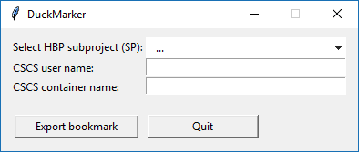
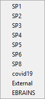

# DuckMarker

DuckMarker is a utility for generating Cyberduck bookmarks that point to CSCS containers created for sharing data in the Human Brain Project on the [EBRAINS](https://ebrains.eu/services/data-knowledge/share-data/) platform.

Click [here](https://eapapp.github.io/DuckMarker/) to run it directly from your browser, or read on for the Python instructions.

## Usage
1. Select your ***SP*** from the dropdown list:

 
2. Fill in your ***CSCS user name*** (typically *bp000xxx*, where *xxx* are numbers).

3. Fill in the ***name of the container*** you would like to access.

4. Click on ***Export bookmark*** and select where you want to save your bookmark (.duck).

## Notes
 - CSCS user names and container names ***cannot contain spaces***.
 - The container needs to be created before you start using the bookmark.

## How to run the Python file
 - Make sure you have Python or Anaconda on your computer. No external packages or installation needed for running DuckMarker.
 - Download and extract ***DuckMarker.zip***.
 - Windows: double-click ***DuckMarker.bat***
 - Mac: double-click ***DuckMarker.sh***

## How to use Cyberduck bookmarks

1. Quick open: double-click the bookmark (.duck)

2. To add the bookmark to your bookmark collection in Cyberduck:
   - From the menu, select *Bookmark* -> *Toggle bookmarks (Ctrl+B)*
   - Drag the new bookmark (.duck) onto the bookmark list
   
## References
[Connecting to CSCS Swift Storage using CyberDuck](https://user.cscs.ch/storage/object_storage/cyberduck/)
